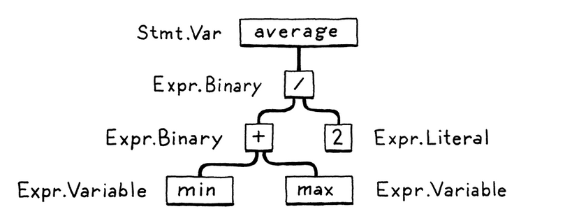

# crafting interpreters

http://www.craftinginterpreters.com

This project is the java part of the book.

```BNF
   expression   -> literal | unary | binary | grouping ;
   literal      -> NUMBER | STRING | "true" | "false" | "nil" ;
   grouping     -> "(" expression ")" ;
   unary        -> ( "-" | "!" ) expression ;
   binary       -> expression operator expression
   operator     -> "==" | "!=" | "<" | "<=" | ">" | ">=" | "+" | "-" | "*" | "/" ;
```

Lower = higher precedence

```BNF
  program       -> statement* EOF ;
  declaration   -> varDecl | statement ;
  varDecl       -> "var" IDENTIFIER ( "=" expression )? ";" ;
  statement     -> exprStmt | ifStmt | printStmt | block ;
  ifStmt        -> "if" "(" expression ")" statement ( "else" statement )? ;
  block         -> "{" declararion "}" ;
  exprStmt      -> expression ";" ;
  printStmt     -> "print" expression ";" ;
  expression    -> assignment ;
  assignment    -> IDENTIFIER "=" assignment | equality ;
  equality      -> comparison ( ( "!=" | "==" ) comparison )* ;
  comparison    -> term ( ( ">" | "<" | ">=" | "<=" ) term )* ;
  term          -> factor ( ( "-" | "+" ) factor )* ;
  factor        -> unary ( ( "/" | "*" ) unary )* ;
  unary         -> ( "!" | "-" ) unary | primary ;
  primary       -> NUMBER | STRING 
                | "true" | "false" | "nil" | "(" expression ")" | IDENTIFIER ; 
```

Statement

```BNF
  program       -> statement* EOF ;
  declaration   -> funDecl | varDecl | statement ;
  statement     -> exprStmt | ifStmt | whileStmt | forStmt | printStmt | block | returnStmt ;
  returnStmt    -> "return" expression? ";" ;
  forStmt       -> "for" "(" ( varDecl | exprStmt | ";" ) 
                    expression? ";" 
                    expression? "  ")" statement ;
  varDecl       -> "var" IDENTIFIER ( "=" expression )? ";" ;
  funDecl       -> "fun" function ;
  function      -> IDENTIFIER "(" parameters? ")" block ;
  whileStmt     -> "while" "(" expression ")" statement ;
  ifStmt        -> "if" "(" expression ")" statement ( "else" statement )? ;
  block         -> "{" declararion* "}" ;
  exprStmt      -> expression ";" ;
  printStmt     -> "print" expression ";" ;
```

Expression

```BNF
  parameters    -> IDENTIFIER ( "," IDENTIFIER )* ;
  arguments     -> expression ( "," expression )* ;
  expression    -> assignment ;
  assignment    -> logic_or | IDENTIFIER "=" assignment ;
  logic_or      -> logic_and ( "or" logic_and )* ;
  logic_and     -> equality ( "and" equality )* ;
  equality      -> comparison ( ( "!=" | "==" ) comparison )* ;
  comparison    -> term ( ( ">" | "<" | ">=" | "<=" ) term )* ;
  term          -> factor ( ( "-" | "+" ) factor )* ;
  factor        -> unary ( ( "/" | "*" ) unary )* ;
  unary         -> ( "!" | "-" ) unary | call ;
  call          -> primary ( "(" arguments? ")" ) ;
  primary       -> NUMBER | STRING
                 | "true" | "false" | "nil" | "(" expression ")" | IDENTIFIER ; 
```

## Chapter 2 - A map of the territory

---

### Chapter 2.1 The parts of a language

#### Lexer/Scanner

* Takes source code and turn it into tokens
    * var vari = a; turn into ["var", "veri", "=", "a", ";"]
    * 
        * Removes stuff like whitespace and comments

#### Parsing

* Turns the list of tokens into an Abstract syntax tree or AST
* 

#### Static analysis

* The First step in the analysis is to bind all the identifiers together.
    * (a + b) what is a and what is b, find their declaration and bind them together.
        * if the language is statically, this is where type checking happens
    * Multiple ways of storing the information gather during this process
        * Store the attributes in the AST itself
        * Lookup table/Symbol table
        * Transform the tree into a new structure that directly expresses the code.

#### intermediate representation

* an interface between the source and compiler, makes it easier to write one compiler and many "frontends"

#### Optimization

* Not the focus of this book
* Keywords for later research:
    * constant propagation
    * common subexpression elimination
    * loop invariant code motion
    * global value numbering
    * strength reduction
    * scalar replacement of aggregates
    * dead code elimination
    * loop unrolling

#### Code gen

* Real CPU or Virtual
    * Real need assembly, one compiler for each CPU architecture, ARM, x86
    * Virtual compiles to Bytecode (former P-code), instructions are often one byte long

#### Virtual machine

* two options for bytecode
    * mini-compiler, compiles the bytecode into native code. the bytecode becomes an IR
    * Virtual machine, to simulate a CPU that can run your bytecode in runtime.
        * If you write the VM in C, you can compile the VM to different CPUs (C part of the book does this)

#### Runtime

* The runtime provides services to the language while it's running:
    * Garbage collection
    * instance of
* In fully complied languages the runtime is inserted in the executable (Go)
* If the language is interpreted or runs in a VM, the runtime is connected there (java)

### Chapter 2.2 Shortcuts and alternate routes

#### Single-pass compilers

* Compiles the code in a single pass.
    * Saves memory, don't need to store AST or an IR
* When C was made, it was a single-pass compiler, which is why you need declaration of a function before using it

#### Tree-walker interpreters

* Runs on the AST, in general, slow and often used for student projects and small languages.
* The first interpreter we make in this book works like this.

#### Transpiler

* Translating source code to a different language.
* If the languages are semantically similar, there might be no static analysis

#### Just-In-Time compilation

* Compiles to native code from bytecode (Java) or source (javascript) while running the code.
* Recompiles the code during execution of the code
    * Hooks to profile the program to optimize and recompile.

### Chapter 2.3 Compilers and interpreters

* Compiling is the act of translating source code to normally lower level code.
* Transpiling is compiling.
* A compiler compiles the code but doesn't run it
* An interpreter runs the source code, "runs from source"
* Many scripting languages are mix of both interpreted and compiled.
    * CPython, Lua is a couple of languages like this

## Chapter 4

### Challenges

1. Python is not a regular language, since you cant use a regex to parse the grammar.
   python is indent sensitive, and
   you need to know the level of indention which you cant do with regex.
2. TODO
3. Python needs to know the white space to know what scope its in.
   Comments might be used to create better debugging, can be used to create documention (javaDoc)
   and if you want to source-to-source you might want to keep comments in.

## Chapter 5

### Context-free grammars

Context-free grammars is the next heaviest hammer in the formalr grammars toolbox

Formal grammars job is to say which strings are valid
"eggs are tasty for breakfast" would be valid, but not "tasty breakfast for are eggs"

#### Rules for grammars

##### derivations

* Generate strings from the rules
* Rules are called prodcutions since they produce a string
* each prodcution in a context free grammar has a head and a body
* Head its name
* Body is what it generates (List of symbols)
    * Terminal - Terminal as in end, (tokens from scanner like (if or 1234))
    * Nonterminal - Is a reference to another rule
    * lexemes are all caps
* Rules can have the same name

##### BNF

A way to write down the rules of a language

* Format:
    * Name -> then a sequence of symbols ending with ;
    * terminals are surrounded with "" nonterminals are lowercase words
      


To make the syntax easier to write we use | as or so we can write

* bread → "toast" | "biscuits" | "English muffin" ;
* we can also use () to group them protein → ( "scrambled" | "poached" | "fried" ) "eggs" ;
* and normal regex recursion crispiness → "really" "really"* ;
* ? to make it optional zore or 1 time breakfast → protein ( "with" breakfast "on the side" )? ;
  With all the syntax sugar
* 

#### A grammar for Lox  expressions

* Literals: Numbers, strings, Booleans and nil.
* Unary expressions: prefix ! to perform a logical bot, and - to negate a number
* Binary expressions: infix arithmetic (+, -, *, /) and logical operators (==, !=, <, <=, >, >=)
* Parentheses: A pair of ( and ) wrapped around an expression

```BNF
   expression   -> literal | unary | binary | grouping ;
   literal      -> NUMBER | STRING | "true" | "false" | "nil" ;
   grouping     -> "(" expression ")" ;
   unary        -> ( "-" | "!" ) expression ;
   binary       -> expression operator expression
   operator     -> "==" | "!=" | "<" | "<=" | ">" | ">=" | "+" | "-" | "*" | "/" ;
```

```
( "(" ( expr ( "," expr )* )? ")" | "." IDENTIFIER )+ | IDENTIFIER | NUMBER

( "(" ( expr ( "," expr )* )? ")" | "." IDENTIFIER )+
IDENTIFIER
NUMBER


"(" ( expr ( "," expr )* )? ")"
"." IDENTIFIER
IDENTIFIER
NUMBER

"(" ( expr ( "," expr )* )? ")"
"(" expr ")"
"." IDENTIFIER
IDENTIFIER
NUMBER


"(" ( expr ( "," expr )* )? ")"
"(" expr ")"
"(" ")"
"." IDENTIFIER
IDENTIFIER
NUMBER

expr -> "(" expr  "," expr  ")"
expr -> "(" expr ")"
expr -> "(" ")"
expr -> "." IDENTIFIER
expr -> IDENTIFIER
expr -> NUMBER


```

```BNF
  expr          -> expr ( "(" ( expr ( "," expr )* )? ")" | "." IDENTIFIER )+ | IDENTIFIER | NUMBER
  
  
  expr          -> expr ( "(" ( expr ( "," expr )* )? ")" | "." IDENTIFIER )
  expr          -> expr IDENTIFIER
  expr          -> expr NUMBER 
 
 
  expr          -> expr "(" ( expr ( "," expr )* )? ")"
  expr          -> expr "." IDENTIFIER
  expr          -> expr IDENTIFIER
  expr          -> expr NUMBER 
  
  
  expr          -> expr "(" ( expr ( "," expr )* )? ")"
  expr          -> expr "("  ")"
  expr          -> expr "." IDENTIFIER
  expr          -> expr IDENTIFIER
  expr          -> expr NUMBER 
  
  
  
  expr          -> expr "(" ( expr ( "," expr )* )? ")"
  expr          -> expr "("  expr "," expr  ")"
  expr          -> expr "("  ")"
  expr          -> expr "." IDENTIFIER
  expr          -> expr IDENTIFIER
  expr          -> expr NUMBER 
```

### Chapter 6

#### Ambiguity and the Parsing Game

* Precedence: Operator with higher precedence are said to "bind tighter"
* Associativity: Left or right side first, Assignment are right-handed


### Chapter 7

Code will run! Let's go!

#### Values

We need to hold all the values used in the Lox language as Java objects


#### Evaluating Expressions

Further reading https://en.wikipedia.org/wiki/Interpreter_pattern
We will be using the visitor pattern
Same with the AstPrinter we tell each expr type how to evaluate itself.

##### Evaluating literals

Literals are "pure" values, its written in the code itself,
unlike calculated values, so we can just extract it from the expr itself.

##### Evaluating parentheses

parentheses should evaluate everything inside the parentheses and "become" that value,
so recursion here works well.

##### Evaluating unary expressions

Like grouping (parentheses) has a single subexpression, we must evaluate first.

We can't evaluate the unary operator itself until we evaluate its subexpressions (POST-ORDER TRAVERSAL)

#### Runtime erroes

We don't want to crash the whole JVM when an runtime error occurs.
A user running the REPL should not be able to crash the whole thing but instead ignore the line.

#### Detecting runtime errors

Our tree-walk interperer evaluates nested expressions using recursion.
We need to unwind it when an error occurs
Java exceptions works well here.

### Chapter 8

#### Scope
Block scopes shadows global scope

Each block has its own environment

Chaining environments, inner scope has ref to outer scope.


### Chapter 9

Conditional or branching control flow (If)

Looping control flow (for, while)


### Chapter 10


#### nameless functions

Step 1:
Separate functions declaration and its body into two separate objects.
One function statement and one function expression.
* In the parser, we parse the full function if we find FUN in a declaration.
  But when we find FUN in primary, we only parse out the body, without the IDENTIFIER.
* We also make LoxFunction to take in name as a parameter in the constructor,
  and an Expr.Function instead of a Stmt.Function.
  This allows us to create a function without a name.
* update visitFunctionStmt to reflect changes in LoxFunction


Diffrence between function expression and statement
Function expression:
 * Is the actual function body itself
Function statement:
 * Is the "name" of the function. the header in C has function Declarations.


